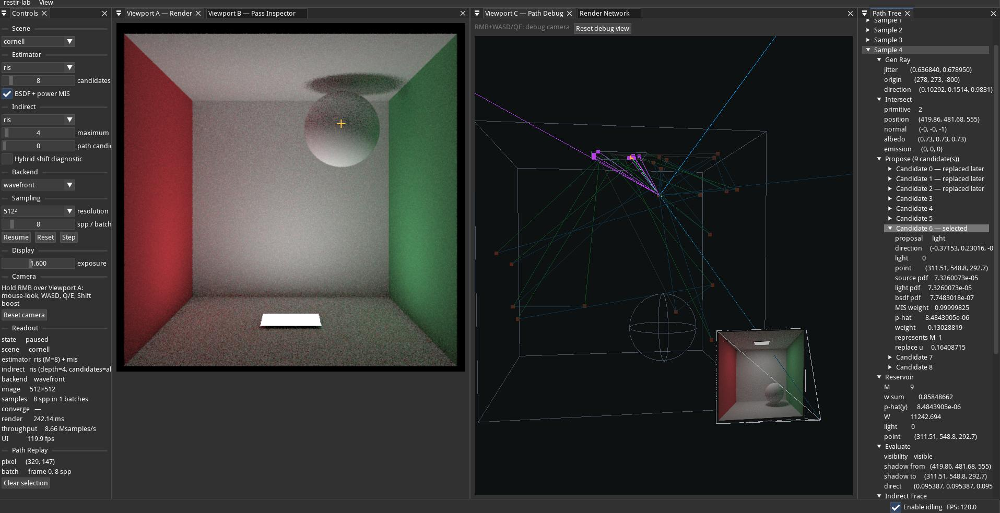
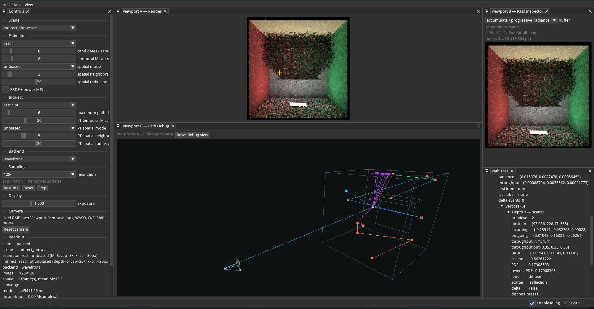
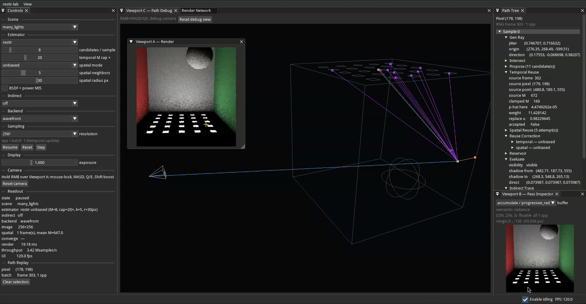
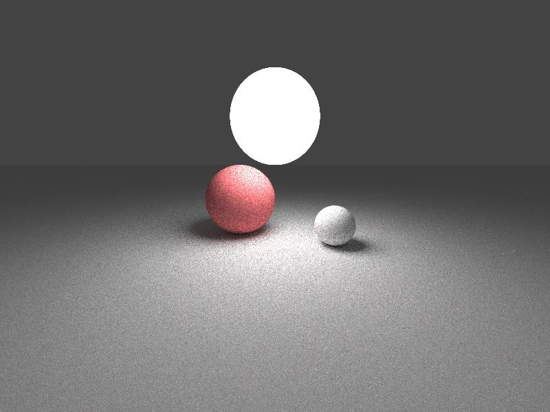
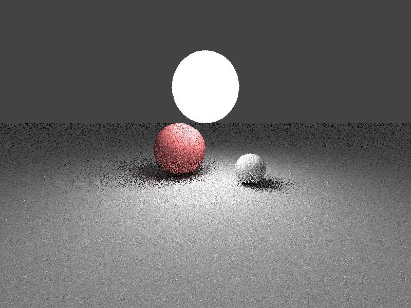
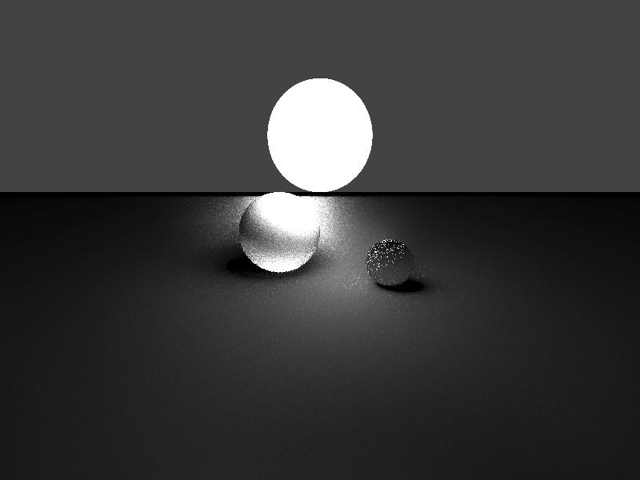

# ReSTIR Notes & Scratchpad

* TOC
{:toc}

## ReSTIR Lab Workbench

### Demo

- ReSTIR Lab video demo:

  <video width="640" height="360" src="re-lab/restir-lab-demo.mp4" type="video/mp4" controls muted />
  https://ikrima.github.io/topos.noether/restir/re-lab/restir-lab-demo.mp4

- ReSTIR Screenshots:
  
  
  

This is my ReSTIR lab workbench that I made to explore and play with the algorithm.
I meant it to be a "Gentle Restir Intro For Engineers" to Chris Wyman's [Gentle Intro To ReSTIR](https://intro-to-restir.cwyman.org/)

**Features:**

- EDN-IR compiler
- Frostrbite FrameGraph Architecture
- Imperative Shell > Functional Core > mutability between passes as long as referentially transparent |= decouples scheduling optimization plan (HOW/WHEN/WHERE) from algorithm (WHAT)
- Graphs as Passes/Resources by string-interned Paths like Houdini
- Debuggability/Introspectability through Cooking/Baking Caches and Deterministic playback with counter based RNG streams

### Highlevel Pseudocode Architecture

- **Tier-0 EDN HIR:** symbolic 'why', high-level IR of cornell box, semantic intent

  ```clj
  ;; ==========================================================================
  ;; TIER-0 (authored intent) — for reference / diff baseline
  ;; ==========================================================================
  {:camera     {:eye [0.5 0.5 -1.3] :look-at [0.5 0.5 0.5]
                :fov-deg 40.0 :res [512 512]}          ; up OMITTED (defaulted)
   :integrator {:type :direct-lighting :spp 16 :light-sampling :uniform_area
                :seed 0}
   :materials  [{:type :lambert :id "m_white" :albedo [0.73 0.73 0.73]}
                {:type :lambert :id "m_red"   :albedo [0.65 0.05 0.05]}
                {:type :lambert :id "m_green" :albedo [0.12 0.45 0.15]}]
   :geometry   [{:type :quad :id "floor"   :corner [0 0 0] :u [1 0 0] :v [0 0 1] :material "m_white"}
                {:type :quad :id "ceiling" :corner [0 1 0] :u [1 0 0] :v [0 0 1] :material "m_white"}
                {:type :quad :id "back"    :corner [0 0 1] :u [1 0 0] :v [0 1 0] :material "m_white"}
                {:type :quad :id "left"    :corner [0 0 0] :u [0 1 0] :v [0 0 1] :material "m_red"}
                {:type :quad :id "right"   :corner [1 0 0] :u [0 0 1] :v [0 1 0] :material "m_green"}
                {:type :sphere :id "s_left"  :center [0.35 0.20 0.65] :radius 0.20 :material "m_white"}
                {:type :sphere :id "s_right" :center [0.65 0.15 0.35] :radius 0.15 :material "m_white"}]
   :lights     [{:type :quad-light :id "key" :corner [0.35 0.999 0.35]
                 :u [0.30 0 0] :v [0 0 0.30] :emission [17.0 12.0 4.0]}]}

  ;; ==========================================================================
  ;; TIER-1 (elaborated) — resolved, defaulted, normalized, expanded
  ;; ==========================================================================
  {:camera
   {;; NORMALIZE: basis computed; look-at/up/fov collapsed into vectors+scalars
    :eye     [0.5 0.5 -1.3]
    :forward [0.0 0.0 1.0]          ; norm(look_at - eye)
    :right   [1.0 0.0 0.0]          ; norm(forward x up)
    :up      [0.0 1.0 0.0]          ; right x forward (re-orthogonalized)
    :tan-half-fov 0.36397           ; tan(40deg/2)
    :aspect  1.0                    ; 512/512
    :width   512 :height 512}

   ;; RESOLVE: materials are now a POSITIONAL table. Indices below reference these.
   ;; Note the appended emissive material (index 3) synthesized from the light.
   :materials
   [{:albedo [0.73 0.73 0.73] :emission [0.0 0.0 0.0]}   ; 0  m_white
    {:albedo [0.65 0.05 0.05] :emission [0.0 0.0 0.0]}   ; 1  m_red
    {:albedo [0.12 0.45 0.15] :emission [0.0 0.0 0.0]}   ; 2  m_green
    {:albedo [0.0 0.0 0.0]    :emission [17.0 12.0 4.0]}] ; 3  <synth: key light>

   ;; RESOLVE (material str->idx) + NORMALIZE (normal, area precomputed).
   ;; :light is -1 for non-emitters; the last prim (7) back-refs light 0.
   :prims
   [{:kind :quad :corner [0 0 0] :u [1 0 0] :v [0 0 1] :material 0
     :normal [0 1 0]  :area 1.0 :light -1}                 ; 0 floor
    {:kind :quad :corner [0 1 0] :u [1 0 0] :v [0 0 1] :material 0
     :normal [0 -1 0] :area 1.0 :light -1}                 ; 1 ceiling
    {:kind :quad :corner [0 0 1] :u [1 0 0] :v [0 1 0] :material 0
     :normal [0 0 -1] :area 1.0 :light -1}                 ; 2 back
    {:kind :quad :corner [0 0 0] :u [0 1 0] :v [0 0 1] :material 1
     :normal [1 0 0]  :area 1.0 :light -1}                 ; 3 left  (red)
    {:kind :quad :corner [1 0 0] :u [0 0 1] :v [0 1 0] :material 2
     :normal [1 0 0]  :area 1.0 :light -1}                 ; 4 right (green)
    {:kind :sphere :center [0.35 0.20 0.65] :radius 0.20 :material 0 :light -1} ; 5
    {:kind :sphere :center [0.65 0.15 0.35] :radius 0.15 :material 0 :light -1} ; 6
    {:kind :quad :corner [0.35 0.999 0.35] :u [0.30 0 0] :v [0 0 0.30]
     :material 3 :normal [0 -1 0] :area 0.09 :light 0}]     ; 7 <synth light geom>

   ;; STITCH: light back-references prim 7; normal/area precomputed for sampling.
   :lights
   [{:kind :quad :corner [0.35 0.999 0.35] :u [0.30 0 0] :v [0 0 0.30]
     :emission [17.0 12.0 4.0] :normal [0 -1 0] :area 0.09 :prim 7}]  ; 0 key

   ;; EXPAND: the integrator became an explicit, validated pass DAG.
   :graph
   {:resources
    [{:name "rays"        :dtype "f32" :channels 8}
     {:name "hits"        :dtype "f32" :channels 8}
     {:name "light_smp"   :dtype "f32" :channels 8}
     {:name "shadow_vis"  :dtype "u8"  :channels 1}
     {:name "radiance"    :dtype "f32" :channels 3}
     {:name "framebuffer" :dtype "f32" :channels 3}]
    :passes
    [{:name "camera_rays"  :kernel "k_camera_rays"
      :reads [] :writes ["rays"]           :params {:spp 16 :seed 0}}
     {:name "intersect"    :kernel "k_intersect"
      :reads ["rays"] :writes ["hits"]}
     {:name "sample_light" :kernel "k_sample_light_uniform"
      :reads ["hits"] :writes ["light_smp"]
      :params {:strategy :uniform_area :M 1 :n-lights 1 :seed 0}}
     {:name "shadow_rays"  :kernel "k_visibility"
      :reads ["hits" "light_smp"] :writes ["shadow_vis"]}
     {:name "shade"        :kernel "k_shade_direct"
      :reads ["hits" "light_smp" "shadow_vis"] :writes ["radiance"]}
     {:name "accumulate"   :kernel "k_accumulate"
      :reads ["radiance"] :writes ["framebuffer"] :params {:spp 16}}]}

   :spp 16 :seed 0
   :meta {:integrator "DirectLighting" :n-prims 8 :n-lights 1}}
  ```

- **Tier-1 Structural MIR**: symbolic 'what', machine-lowerable, jit-executable

  ```python
  # ---------------------------------------------------------------------------
  # Handles: every symbolic name from Tier-0 becomes a small integer here.
  # NewType-style ints keep intent readable without runtime cost.
  # ---------------------------------------------------------------------------
  MaterialId = int          # index into Elaborated.materials
  PrimId     = int          # index into Elaborated.prims
  LightId    = int          # index into Elaborated.lights
  BufferId   = int          # index into the resource table (step-3 graph)

  # ---- Materials: flattened, no ids, positional ------------------------------
  @dataclass(frozen=True)
  class M_Lambert:
      albedo: tuple[float, float, float]
      # emission carried here too so "is this prim a light?" is a field lookup,
      # not a cross-table search during shading.
      emission: tuple[float, float, float] = (0.0, 0.0, 0.0)

  Material1 = M_Lambert

  # ---- Geometry: tagged, flattened, material resolved to index ---------------
  @dataclass(frozen=True)
  class P_Sphere:
      center: tuple[float, float, float]
      radius: float
      material: MaterialId
      # back-reference to a light, if this prim IS an emitter (else -1).
      # Lets the intersect->emission path skip a lookup.
      light: LightId = -1

  @dataclass(frozen=True)
  class P_Quad:
      corner: tuple[float, float, float]
      u: tuple[float, float, float]
      v: tuple[float, float, float]
      material: MaterialId
      # Precomputed derived geometry (normalization job):
      normal: tuple[float, float, float] = (0.0, 0.0, 0.0)
      area: float = 0.0
      light: LightId = -1

  Prim1 = P_Sphere | P_Quad

  # ---- Lights: with a back-reference to the geometry they live on ------------
  @dataclass(frozen=True)
  class L_Quad:
      corner: tuple[float, float, float]
      u: tuple[float, float, float]
      v: tuple[float, float, float]
      emission: tuple[float, float, float]
      # Precomputed for uniform-area sampling & the geometry term:
      normal: tuple[float, float, float]
      area: float
      prim: PrimId               # the geometry index this light is attached to

  Light1 = L_Quad

  # ---- Camera: basis + derived quantities precomputed ------------------------
  @dataclass(frozen=True)
  class Camera1:
      eye: tuple[float, float, float]
      # orthonormal basis (right, up, forward) — computed once here, not per ray
      right:   tuple[float, float, float]
      up:      tuple[float, float, float]
      forward: tuple[float, float, float]
      tan_half_fov: float
      aspect: float
      width: int
      height: int

  # ---------------------------------------------------------------------------
  # The expanded pass DAG (Frostbite-flavored: passes DECLARE their I/O).
  # Elaborate BUILDS and VALIDATES this; step-3 compile CULLS/aliases it.
  # ---------------------------------------------------------------------------
  @dataclass(frozen=True)
  class ResourceDecl:
      """A logical (transient) buffer the graph will back with arena memory."""
      name: str                              # human-readable, for debug/diff
      dtype: Literal["f32", "u32", "u8"]
      # per-element shape; the leading pixel/ray count is filled at compile time
      channels: int

  @dataclass(frozen=True)
  class PassNode:
      name: str                              # e.g. "camera_rays"
      kernel: str                            # symbolic kernel id -> bound in Tier-2
      reads:  tuple[str, ...]                # resource names read
      writes: tuple[str, ...]                # resource names written
      # static parameters resolved at elaborate time (e.g. spp, sampling mode)
      params: dict = field(default_factory=dict)

  @dataclass(frozen=True)
  class PassGraph:
      resources: tuple[ResourceDecl, ...]
      passes: tuple[PassNode, ...]           # declaration order; DAG edges are
                                            # implied by reads/writes on names

  # ---- The Tier-1 root -------------------------------------------------------
  @dataclass(frozen=True)
  class Elaborated:
      camera: Camera1
      materials: tuple[Material1, ...]       # positional; index == MaterialId
      prims: tuple[Prim1, ...]               # positional; index == PrimId
      lights: tuple[Light1, ...]             # positional; index == LightId
      graph: PassGraph
      # provenance: enough to reconstruct/debug the lowering
      spp: int
      seed: int
      meta: dict = field(default_factory=dict)
  ```
- **Tier-2 Execution LIR**: symbolic 'how', the compiled, memory-scheduled graph executable-ready

  ```python
  BufferId = int          # index into CompiledGraph.buffers
  PassIdx  = int          # index into CompiledGraph.schedule

  # ---- A physical buffer plan: logical resource -> arena placement -----------
  @dataclass(frozen=True)
  class BufferPlan:
      id: BufferId
      name: str                      # from the Tier-1 ResourceDecl (debug/diff)
      dtype: Literal["f32", "u32", "u8"]
      channels: int
      # Lifetime as a half-open interval over the SCHEDULE (not wall-clock):
      # this buffer is live for passes [first_write, last_read].
      first_write: PassIdx
      last_read: PassIdx
      # Memory assignment (computed by the aliasing allocator):
      arena_slot: int                # which reusable slot this buffer aliases into
      # Persistent buffers (ReSTIR reservoirs) escape the frame arena entirely.
      persistent: bool = False

  # ---- A compiled pass: kernel bound, resources resolved to BufferIds --------
  @dataclass(frozen=True)
  class CompiledPass:
      idx: PassIdx
      name: str
      kernel: str                    # symbolic id; bound to a callable in shell
      reads: tuple[BufferId, ...]    # resolved from names
      writes: tuple[BufferId, ...]
      params: dict = field(default_factory=dict)
      # cook-cache key ingredient: what static inputs define this pass's output.
      param_hash: int = 0

  # ---- The Tier-2 root: everything execute needs, nothing it must compute ----
  @dataclass(frozen=True)
  class CompiledGraph:
      schedule: tuple[CompiledPass, ...]   # topologically ordered; execute walks
                                          # this in order, period.
      buffers: tuple[BufferPlan, ...]      # indexed by BufferId
      # Arena layout summary: how many reusable slots, and each slot's byte size
      # (max over the buffers that alias into it). Lets the shell size the arena.
      arena_slots: tuple[int, ...]         # slot_index -> bytes-per-element run
      culled: tuple[str, ...]              # names of passes removed as dead
      # Precomputed reverse edges for dirty-propagation (name -> dependent passes)
      dependents: dict[int, tuple[PassIdx, ...]] = field(default_factory=dict)
  ```

### Basic Taichi CPU/GPU ReSTIR

This was my initial reference implementation using Taichi and following several of the references and courses listed below such as this Siggraph Course "A Gentle Introduction to ReSTIR Path Reuse in Real-Time" featuring a lot of the authors such as Chris Wyman, Daqi Lin, Benedikt Betterli, Markus Kettermun.
You can also find foundational code and explanations via the [ReSTIR PT GitHub Repository](https://github.com/DQLin/ReSTIR_PT)

- Baseline Monte Carlo path tracer with NEE (100 spp):
  
- Basic RIS path tracer — 1 spp with 32-candidate reservoir sampling (1 spp, 32 candidates):
  
- ReSTIR DI — 4-pass pipeline with Generalized Balance Heuristic (32 frames):
  
- ReSTIR PT — Path Tracing with Multi-Bounce PSS, Random Replay & Diffuse Reconnection (32 frames):
  
- Code

  ```python
  Coming soon!
  ```

## Research Diary

These are pretty printed and visualized of my research notes/stream of consciousness messy thoughts.
These are still very much early drafts/WIP so don't let the interactive AI polish trip you.

### Measure Theory ReSTIR

- [index](measure-theory/index.html)
- [essay-01-pushforward-pullback](measure-theory/essays/essay-01-pushforward-pullback.html)
- [essay-02-residual-measure-transport](measure-theory/essays/essay-02-residual-measure-transport.html)
- [essay-03-biomimetic-reservoir-intelligence](measure-theory/essays/essay-03-biomimetic-reservoir-intelligence.html)
- [essay-04-shape-of-a-reservoir](measure-theory/essays/essay-04-shape-of-a-reservoir.html)
- [essay-05-curvature-of-reuse](measure-theory/essays/essay-05-curvature-of-reuse.html)
- [essay-06-pixel-is-not-a-point](measure-theory/essays/essay-06-pixel-is-not-a-point.html)
- [essay-07-geometry-of-light-transport](measure-theory/essays/essay-07-geometry-of-light-transport.html)
- [essay-08-curvature-guided-sampling](measure-theory/essays/essay-08-curvature-guided-sampling.html)

### Measure Decomposition ReSTIR

- [measure-decomposition/index](measure-decomposition/index.html)
- [measure-decomposition/part1](measure-decomposition/part1.html)
- [measure-decomposition/part2](measure-decomposition/part2.html)
- [measure-decomposition/part3](measure-decomposition/part3.html)
- [measure-decomposition/part4](measure-decomposition/part4.html)
- [measure-decomposition/part5](measure-decomposition/part5.html)
- [measure-decomposition/part6](measure-decomposition/part6.html)
- [measure-decomposition/poc](measure-decomposition/poc.html)

### Various Explorations

- [gris-foundations](gris-foundations.html)
- [gris-math-analysis-01](gris-math-analysis-01.html)
- [gris-math-analysis-02](gris-math-analysis-02.html)
- [gris-math-analysis-03](gris-math-analysis-03.html)
- [restir-reservoirs-of-light-01](restir-reservoirs-of-light-01.html)
- [restir-reservoirs-of-light-02](restir-reservoirs-of-light-02.html)
- [restir-reservoirs-of-light-03](restir-reservoirs-of-light-03.html)
- [restir-reservoirs-of-light-04](restir-reservoirs-of-light-04.html)
- [restir-reservoirs-of-light-05](restir-reservoirs-of-light-05.html)
- [restir-volumetric](restir-volumetric.html)
- [square-root-sphere](square-root-sphere.html)
